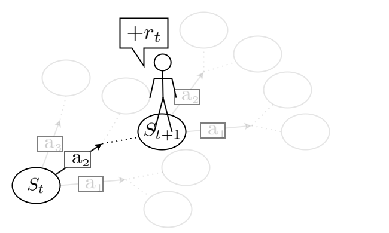
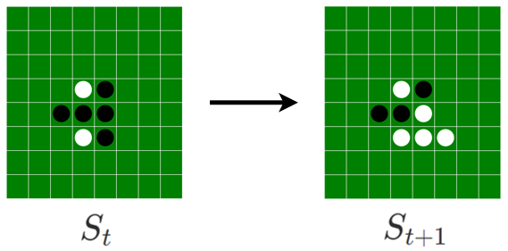
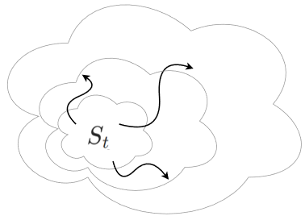

# Reinforcement Learning for Stochastic Continuous Dynamics:A Model-Free, Value-Based Approach

Haruki Settai, Naoya Takeishi, Takehisa Yairi

---
layout: full
---

Haruki Settai, Naoya Takeishi, Takehisa Yairi

<!--
今回は強化学習の導入の話．必要な事前知識であるマルコフ決定過程について，そのモチベーションと，簡単な定義を導入します．
-->

---
layout: default
maxDepth: 1
layout: full
---

  <Toc />

---

# Overview

---
fonts:
  sans: 'Zen Maru Gothic'
layout: full
---

## TD;LR

強化学習を"ダイナミクスが確率微分方程式で記述されている系"に適用するためのアルゴリズムを提案した。 

<v-click>- 強化学習(RL) </v-click>
<v-click>　<strong>・意思決定を行うための機械学習手法</strong>。ロボットの制御やLLMの学習, 将棋AIなどで使われる。 </v-click>
<v-click>　・従来は状態遷移が離散的な系上の最適化問題として定式化されている。 </v-click>

<v-clicks>

<figure style="position: absolute; top: 54%; right: 20%; width: 300px;">
  
  <figcaption style="font-size: 0.8em; word-wrap: break-word; text-align: center; width: 200px; position: absolute; top: 102%; left: 20%;">RLの学習の様子
  </figcaption>
</figure>

- 確率微分方程式(SDE) 
　<strong>・ノイズがのった微分方程式</strong>。

<figure style="position: absolute; top: 59%; right: 60%; width: 300px;">
  
  <figcaption style="font-size: 0.8em; word-wrap: break-word; text-align: center; width: 200px; position: absolute; top: 102%; left: 20%;">SDE
  </figcaption>
</figure>

</v-clicks>

- 確率微分方程式(SDE) 
　<strong>・ノイズがのった微分方程式</strong>。

<v-click>

<strong>工学的な視点からの補足</strong> 
確率最適制御では, 目的関数などに様々な仮定をおいて最適な制御を解析的に求めるが, 提案手法は同じ目的関数をデータ駆動で解く。
解析的に望ましい仮定を一切置く必要がなく, 現実の複雑なモデルでも最適な制御を見つけられる。 
確率最適制御と強化学習の橋渡し的な研究。

</v-click>

<v-click>

<strong>先行研究との差分</strong> 
先行研究ではダイナミクスの方程式が具体的にわかっていないと学習できず, 振り子のようなオモチャに応用が限定されていた。
提案手法では, ダイナミクスの方程式をまったく知る必要がないため連続的な系ならなんでも適用できる。

</v-click>

<!--
発表用コメントをここに書く
-->

---
fonts:
  sans: 'Zen Maru Gothic'
---

## モチベーション

  

    

      

        <!-- MDP1 -->
        

          <figure style="position: absolute; top: 30%; left: 10%; width: 350px; text-align: center;">
            
            <figcaption style="font-size: 1.0em; text-align: center; width: 200px; position: absolute; top: 102%; left: 20%;">
              強化学習の舞台
            </figcaption>
          </figure>
        

        <!-- MDP2 -->
        

          <figure style="position: absolute; top: 30%; left: 10%; width: 350px; text-align: center;">
            
            <figcaption style="font-size: 1.0em; text-align: center; width: 200px; position: absolute; top: 102%; left: 20%;">
              強化学習の舞台
            </figcaption>
          </figure>
        

      

      <!-- MDP3 -->
      

        <figure style="position: absolute; top: 30%; left: 10%; width: 350px; text-align: center;">
          
          <figcaption style="font-size: 1.0em; text-align: center; width: 200px; position: absolute; top: 102%; left: 20%;">
            強化学習の舞台
          </figcaption>
        </figure>
      

    

    

      <figure style="position: absolute; top: 30%; left: 10%; width: 350px; text-align: center;">
        
        <figcaption style="font-size: 1.0em; text-align: center; width: 200px; position: absolute; top: 102%; left: 20%;">
          強化学習の舞台
        </figcaption>
      </figure>
    

  

  

    <figure style="position: absolute; top: 30%; left: 10%; width: 350px; text-align: center;">
      
      <figcaption style="font-size: 1.0em; text-align: center; width: 200px; position: absolute; top: 102%; left: 20%;">
        強化学習の舞台
      </figcaption>
    </figure>
  

  <figure style="position: absolute; top: 30%; left: 10%; width: 350px; text-align: center;">
    
    <figcaption style="font-size: 1.0em; text-align: center; width: 200px; position: absolute; top: 102%; left: 20%;">
      強化学習の舞台
    </figcaption>
  </figure>

<v-click>
<figure style="position: absolute; top: 15%; left: 20%; width: 150px; text-align: center;">
  
</figure>
</v-click>

<v-click>
<figure style="position: absolute; top: 77%; left: 15%; width: 230px; text-align: center;">
  
</figure>
<figcaption style="font-size: 1.0em; text-align: center; width: 200px; position: absolute; top: 92%; left: 18%;">
  ダイナミクスを支配する式
</figcaption>
</v-click>

<v-click>
<figure style="position: absolute; top: 12%; left: 65%; width: 120px; text-align: center;">
  
</figure>
</v-click>

<v-click>
<figure style="position: absolute; top: 35%; left: 58%; width: 250px; text-align: center;">
  
  <figcaption style="font-size: 1.0em; text-align: center; width: 200px; position: absolute; top: 102%; left: 20%;">
    状態が連続的に発展
  </figcaption>
</figure>
</v-click>

<v-click>
<figure style="position: absolute; top: 75%; left: 58%; width: 250px; text-align: center;">
  
  <figcaption style="font-size: 1.0em; text-align: center; width: 200px; position: absolute; top: 102%; left: 20%;">
    ダイナミクスを支配する式
  </figcaption>
</figure>
</v-click>

<v-click>
  <!-- 赤い四角 -->
  

  

  <!-- 注釈 -->
  

    こっちのほうが自然では？
  

</v-click>

<v-click>
  <figure style="position: absolute; top: 40%; left: 46%; width: 90px; text-align: center;">
    
    <figcaption style="font-size: 0.8em">
      実は元の問題に含まれてる
    </figcaption>
  </figure>
</v-click>

<v-clicks>
  

    ⇒連続系でも普通の強化学習を適用できる
  

  

    ⇒離散でも連続でも使えるということは, 連続に固有の 　情報は切り捨てられていて活用できていないということ
  

</v-clicks>
