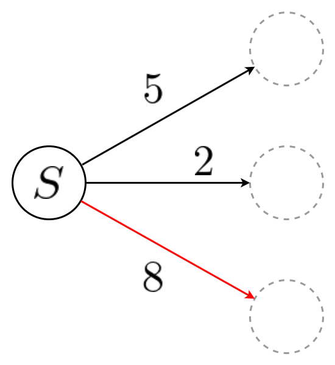

  Supervised by Takehisa Yairi, Naoya Takeishi

<v-click>

    <strong>The most foundational method in Reinforcement Learning</strong>

<figure style="position: absolute; top: 17%; left: 3%; width: 525px; text-align: center;">
  
</figure>
</v-click>
<v-click>

    <strong>The system is governed by a Stochastic Differential Equation</strong>

<figure style="position: absolute; top: 35%; left: 0.2%; width: 800px; text-align: center;">
  
</figure>
</v-click>
<v-click>

    <strong>Reformulated Reinforcement Learning in continuous systems</strong> 
    <strong>which was traditionally formulated in discrete systems</strong>

</v-click>

---
maxDepth: 2
---

  <Toc depth="2" />

---
layout: section
subject: Overview
---

# Overview

---
layout: default
headerEnable: true
headerTitle: Overview
headerLogo: figures/UTokyo.png
---

## Key Contributions
We propose the first model-free reinforcement learning algorithm for continuous-time systems whose dynamics are governed by stochastic differential equations.

<v-clicks>

<strong>Reinforcement Learning (RL)</strong> 
- <strong class="accent">A machine learning framework for decision-making</strong>, widely used in robotics, game AI, and LLM training. 
- Traditionally formulated as an optimization problem over systems with <strong class="accent">discrete state transitions</strong>. 

<figure style="position: absolute; top: 59%; right: 60%; width: 250px; text-align: center;">
  
  <figcaption style="font-size: 1.2em; word-wrap: break-word; margin-top: 4px;">
    training process of RL
  </figcaption>
</figure>

<strong>Stochastic Differential Equation (SDE)</strong> 
- <strong class="danger">A differential equation</strong> with randomness.

<figure style="position: absolute; top: 59%; right: 20%; width: 300px; text-align: center;">
  
  <figcaption style="font-size: 1.2em; word-wrap: break-word; margin-top: -6px;">
    paths of SDE
  </figcaption>
</figure>

</v-clicks>

<strong>Reinforcement Learning (RL)</strong> 
- <strong class="accent">A machine learning framework for decision-making</strong>, widely used in robotics, game AI, and LLM training. 
- Traditionally formulated as an optimization problem over systems with <strong class="accent">discrete state transitions</strong>. 
<strong>Stochastic Differential Equation (SDE)</strong> 
- <strong class="danger">A differential equation</strong> with randomness.

  

  <strong>Engineering Perspective</strong> 
  Bridges stochastic control and RL: Both target the same objective — the former relies on analytical solutions under assumptions, whereas the latter (ours) learns purely from data without such assumptions.
  

<v-click>

<strong>Difference from Previous Work</strong> 
Prior works require explicit knowledge of the system dynamics, limiting applications to toy problems like pendulums. 
In contrast, our method requires no knowledge of the dynamics and can be applied to any continuous system.

</v-click>

---
layout: two-cols
headerEnable: true
headerTitle: Overview
headerLogo: figures/UTokyo.png
---

## Motivation

::left::
**Standard RL Framework**

  

    

      

        

          <v-click>
            <figure style="position: absolute; top: 30%; left: 8%; width: 350px; text-align: center;">
              
              <figcaption style="font-size: 0.8em; text-align: center; width: 200px; position: absolute; top: 102%; left: 20%;">
              Markov Decision Process (MDP)
              </figcaption>
            </figure>
          </v-click>
        

        

          <figure style="position: absolute; top: 30%; left: 8%; width: 350px; text-align: center;">
            
            <figcaption style="font-size: 0.8em; text-align: center; width: 200px; position: absolute; top: 102%; left: 20%;">
            Markov Decision Process (MDP)
            </figcaption>
          </figure>
        

      

      

        <figure style="position: absolute; top: 30%; left: 8%; width: 350px; text-align: center;">
            
            <figcaption style="font-size: 0.8em; text-align: center; width: 200px; position: absolute; top: 102%; left: 20%;">
            Markov Decision Process (MDP)
            </figcaption>
        </figure>
      

    

    

        <figure style="position: absolute; top: 30%; left: 8%; width: 350px; text-align: center;">
        
        <figcaption style="font-size: 0.8em; text-align: center; width: 200px; position: absolute; top: 102%; left: 20%;">
        Markov Decision Process (MDP)
        </figcaption>
        </figure>
    

  

  

    <figure style="position: absolute; top: 30%; left: 8%; width: 350px; text-align: center;">
      
      <figcaption style="font-size: 0.8em; text-align: center; width: 200px; position: absolute; top: 102%; left: 20%;">
      Markov Decision Process (MDP)
      </figcaption>
    </figure>
  

  <figure style="position: absolute; top: 30%; left: 8%; width: 350px; text-align: center;">
      
      <figcaption style="font-size: 0.8em; text-align: center; width: 200px; position: absolute; top: 102%; left: 20%;">
      Markov Decision Process (MDP)
      </figcaption>
  </figure>

<v-click>
<figure style="position: absolute; top: 25%; left: 5%; width: 150px; text-align: center;">
  
</figure>
</v-click>

<v-click>
<figure style="position: absolute; top: 76%; left: 12%; width: 200px; text-align: center;">
  
  <figcaption style="font-size: 0.8em; white-space: nowrap;">
    <strong>Model: Transition Probability Matrix</strong>
  </figcaption>
</figure>
</v-click>

::right::

**Real-World Dynamics**

<v-click>
<figure style="position: absolute; top: 25%; left: 55%; width: 90px; text-align: center;">
  
</figure>
</v-click>

<v-click>
<figure style="position: absolute; top: 40%; left: 62.5%; width: 220px; text-align: center;">
  
  <figcaption style="font-size: 0.8em; text-align: center; width: 200px; position: absolute; top: 102%; left: 10%;">
    Controlled Diffusion Process
    </figcaption>
</figure>
</v-click>

<v-click>
<figure style="position: absolute; top: 77%; left: 62%; width: 250px; text-align: center;">
  
  <figcaption style="font-size: 0.8em; white-space: nowrap;">
    <strong>Model: &mu;, &sigma;</strong>
  </figcaption>
</figure>
</v-click>

    <v-click>
    

    

    

    Can we formulate RL within the framework of this system?
    

    </v-click>

  <figure style="position: absolute; top: 48%; left: 46%; width: 80px; text-align: center;">
    
    <figcaption style="position: absolute; top: 110%; left: -70%; font-size: 0.8em; white-space: nowrap;">
    Actually, this is just a special case of the original problem.
    </figcaption>
  </figure>

<v-click>
<Arrow :x1="600" :y1="435" :x2="369" :y2="471.75" :width="3" class="text-red-500" />
  <svg width="800" height="600" style="position: absolute; top: 0; left: 0; pointer-events: none;">
    <text
        x="487.49"
        y="436.70"
        transform="rotate(-9, 487.49, 436.70)"
        text-anchor="middle"
        dominant-baseline="central"
        font-size="7"
        fill="red"
    >
        transformable*
    </text>
  </svg>
  

    *In continuous time, the object being transformed is the infinitesimal generator, not the transition probability matrix.  The RL framework still applies in the same way.
  

</v-click>

<v-clicks>
  

    &rArr; Actually, MDPs also include continuous systems.
  

  

    &rArr; But by restricting to continuous systems, a more efficient method must exist.
  

</v-clicks>

---
layout: default
headerEnable: true
headerTitle: Overview
headerLogo: figures/UTokyo.png
---

## Contribution

  

    <figure style="position: absolute; top: 18%; left: 5%; width: 300px; text-align: center;">
      
      <figcaption style="font-size: 0.8em; text-align: center; width: 200px; position: absolute; top: 102%; left: 15%;">
        RL Algorithms
      </figcaption>
    </figure>
    <figure style="position: absolute; top: 90%; left: 30%; width: 300px; text-align: center;">
      
    </figure>
    

      <strong>The method in title</strong>
    

    <figure style="position: absolute; top: 24%; left: 26%; width: 300px; text-align: center;">
      
    </figure>
    

      <strong>The most popular and successful method in RL</strong>
    

  

  

    <figure style="position: absolute; top: 90%; left: 30%; width: 300px; text-align: center;">
      
    </figure>
    

      <strong>The method in title</strong>
    

    <figure style="position: absolute; top: 24%; left: 26%; width: 300px; text-align: center;">
      
    </figure>
    

      <strong>The most popular and successful method in RL</strong>
    

    <figure style="position: absolute; top: 74.0%; left: 37%; width: 70px; text-align: center; z-index: 1;">
      
    </figure>
    

      <AnimatedArrow
        id="arrow1"
        :points="[
          [300, 520],
          [300, 530],
          [222, 530]
        ]"
        :stroke-width="4"
        color="#589EFB"
        :glass="true"
      />
    

    <figure style="position: absolute; top: 18%; left: 5%; width: 300px; text-align: center;">
      
      <figcaption style="font-size: 0.8em; text-align: center; width: 200px; position: absolute; top: 102%; left: 15%;">
        RL Algorithms
      </figcaption>
    </figure>
    

    <strong>1. Proposed Method</strong> 
      We propose a method to incorporate the continuity of the dynamics into TD methods, without requiring knowledge of the dynamics itself. We refer to this method as dTD (differentiable TD).

    <strong>2. Analysis</strong> 
      We show that the smoother the underlying model is, the faster the convergence is compared to existing methods.
    

  

  <figure style="position: absolute; top: 90%; left: 30%; width: 300px; text-align: center;">
    
  </figure>
  

    <strong>The method in title</strong>
  

  <figure style="position: absolute; top: 24%; left: 26%; width: 300px; text-align: center;">
    
  </figure>
  

    <strong>The most popular and successful method in RL</strong>
  

  <figure style="position: absolute; top: 74.0%; left: 37%; width: 70px; text-align: center; z-index: 1;">
    
  </figure>
  

    <AnimatedArrow
      id="arrow1"
      :points="[
        [300, 520],
        [300, 530],
        [222, 530]
      ]"
      :stroke-width="4"
      color="#589EFB"
      :glass="true"
    />
  

  <figure style="position: absolute; top: 18%; left: 5%; width: 300px; text-align: center;">
    
    <figcaption style="font-size: 0.8em; text-align: center; width: 200px; position: absolute; top: 102%; left: 15%;">
      RL Algorithms
    </figcaption>
  </figure>
  

  <strong>1. Proposed Method</strong> 
    We propose a method to incorporate the continuity of the dynamics into TD methods, without requiring knowledge of the dynamics itself. We refer to this method as dTD (differentiable TD).

  <strong>2. Analysis</strong> 
    We show that the smoother the underlying model is, the faster the convergence is compared to existing methods.
  

  

    <AnimatedArrow
      id="arrow2"
      :points="[
        [176, 520],
        [176, 476.8],
        [104.5, 476.8],
        [104.5, 457],
      ]"
      :stroke-width="4"
      color="#589EFB"
      :glass="true"
    />
  

  

    <AnimatedArrow
      id="arrow3"
      :points="[
        [104.5, 420],
        [104.5, 406],
        [147, 406],
        [147, 208]
      ]"
      :stroke-width="4"
      color="#589EFB"
      :glass="true"
    />
  

  

  <strong>3. Experiment</strong> 
    We compare the conventional TD-based PPO and our proposed dTD-based PPO using the Brax simulator, and show that the proposed method achieves improved performance. 
  

  <figure style="position: absolute; top: 42%; left: 40%; width: 300px; text-align: center;">
    
    <figcaption style="font-size: 0.8em; white-space: nowrap;">
    brax simulator
    </figcaption>
  </figure>

---
layout: section
subject: Preliminaries on RL
---

# Preliminaries on RL

---
layout: two-cols
headerEnable: true
headerTitle: Preliminaries on RL
headerLogo: figures/UTokyo.png
---

  

    

      <v-click>
        <figure style="position: absolute; top: 30%; left: 8%; width: 350px; text-align: center;">
          
        </figure>
      </v-click>
    

    

      <figure style="position: absolute; top: 30%; left: 8%; width: 350px; text-align: center;">
        
      </figure>
    

  

  

    <figure style="position: absolute; top: 30%; left: 8%; width: 350px; text-align: center;">
        
    </figure>
    

      Choose the biggest one
    

  

  <figure style="position: absolute; top: 30%; left: 8%; width: 350px; text-align: center;">
      
  </figure>

---
layout: two-cols
headerEnable: true
headerTitle: Preliminaries on RL
headerLogo: figures/UTokyo.png
---

**TD method**

::left::

**Discrete**

  <figure style="position: absolute; top: 15%; right: 5%; width: 300px; text-align: center;">
    
  </figure>
  

    

      

        

          

            

              

                

                  

                    

                      

                        

                          

                            

                              <v-click>
                                <figure style="position: relative; top: 0%; left: 0%; width: 220px; text-align: center;">
                                    
                                    <figcaption style="font-size: 0.8em; text-align: center; width: 200px; position: absolute; top: 102%; left: 0%;">
                                    MDP
                                    </figcaption>
                                </figure>
                              </v-click>
                            

                            

                              <figure style="position: relative; top: 0%; left: 0%; width: 220px; text-align: center;">
                                
                                <figcaption style="font-size: 0.8em; text-align: center; width: 200px; position: absolute; top: 102%; left: 0%;">
                                MDP
                                </figcaption>
                              </figure>
                            

                          

                          

                            <figure style="position: relative; top: 0%; left: 0%; width: 220px; text-align: center;">
                              
                              <figcaption style="font-size: 0.8em; text-align: center; width: 200px; position: absolute; top: 102%; left: 0%;">
                              MDP
                              </figcaption>
                            </figure>
                          

                        

                        

                          <figure style="position: relative; top: 0%; left: 0%; width: 220px; text-align: center;">
                            
                            <figcaption style="font-size: 0.8em; text-align: center; width: 200px; position: absolute; top: 102%; left: 0%;">
                            MDP
                            </figcaption>
                          </figure>
                        

                      

                      

                        <figure style="position: relative; top: 0%; left: 0%; width: 220px; text-align: center;">
                          
                          <figcaption style="font-size: 0.8em; text-align: center; width: 200px; position: absolute; top: 102%; left: 0%;">
                          MDP
                          </figcaption>
                        </figure>
                      

                    

                    

                      <figure style="position: relative; top: 0%; left: 0%; width: 220px; text-align: center;">
                        
                        <figcaption style="font-size: 0.8em; text-align: center; width: 200px; position: absolute; top: 102%; left: 0%;">
                        MDP
                        </figcaption>
                      </figure>
                    

                  

                  

                    <figure style="position: relative; top: 0%; left: 0%; width: 220px; text-align: center;">
                      
                      <figcaption style="font-size: 0.8em; text-align: center; width: 200px; position: absolute; top: 102%; left: 0%;">
                      MDP
                      </figcaption>
                    </figure>
                    <figure style="position: absolute; top: 39.4%; left: 26%; width: 150px; text-align: center;">
                      
                      <figcaption style="font-size: 0.8em; text-align: center; width: 200px; position: absolute; top: 120%; left: -15%;">
                      Model
                      </figcaption>
                    </figure>
                  

                

                

                  <figure style="position: relative; top: 0%; left: 0%; width: 220px; text-align: center;">
                    
                    <figcaption style="font-size: 0.8em; text-align: center; width: 200px; position: absolute; top: 102%; left: 0%;">
                    MDP
                    </figcaption>
                  </figure>
                  <figure style="position: absolute; top: 39.4%; left: 26%; width: 150px; text-align: center;">
                    
                    <figcaption style="font-size: 0.8em; text-align: center; width: 200px; position: absolute; top: 120%; left: -15%;">
                    Model
                    </figcaption>
                  </figure>
                  <figure style="position: absolute; top: 61%; left: 14%; width: 80px; text-align: center;">
                    
                    <figcaption style="font-size: 1.2em; position: absolute; top: -25%; left: -125%; font-size: 0.8em; white-space: nowrap;">
                    <strong>Value function:</strong>
                    </figcaption>
                  </figure>
                  

                    ←What we want to know
                  

                

              

              

                <figure style="position: relative; top: 0%; left: 0%; width: 220px; text-align: center;">
                  
                  <figcaption style="font-size: 0.8em; text-align: center; width: 200px; position: absolute; top: 102%; left: 0%;">
                  MDP
                  </figcaption>
                </figure>
                <figure style="position: absolute; top: 39.4%; left: 26%; width: 150px; text-align: center;">
                  
                  <figcaption style="font-size: 0.8em; text-align: center; width: 200px; position: absolute; top: 120%; left: -15%;">
                  Model
                  </figcaption>
                </figure>
                <figure style="position: absolute; top: 61%; left: 14%; width: 80px; text-align: center;">
                  
                  <figcaption style="font-size: 1.2em; position: absolute; top: -25%; left: -125%; font-size: 0.8em; white-space: nowrap;">
                  <strong>Value function:</strong>
                  </figcaption>
                </figure>
                

                  ←What we want to know
                

              

            

            

              <figure style="position: relative; top: 0%; left: 0%; width: 220px; text-align: center;">
                
                <figcaption style="font-size: 0.8em; text-align: center; width: 200px; position: absolute; top: 102%; left: 0%;">
                MDP
                </figcaption>
              </figure>
              <figure style="position: absolute; top: 39.4%; left: 26%; width: 150px; text-align: center;">
                
                <figcaption style="font-size: 0.8em; text-align: center; width: 200px; position: absolute; top: 120%; left: -15%;">
                Model
                </figcaption>
              </figure>
              <figure style="position: absolute; top: 61%; left: 14%; width: 80px; text-align: center;">
                
                <figcaption style="font-size: 1.2em; position: absolute; top: -25%; left: -125%; font-size: 0.8em; white-space: nowrap;">
                <strong>Value function:</strong>
                </figcaption>
              </figure>
              

                ←What we want to know
              

            

          

          

            <figure style="position: relative; top: 0%; left: 0%; width: 220px; text-align: center;">
              
              <figcaption style="font-size: 0.8em; text-align: center; width: 200px; position: absolute; top: 102%; left: 0%;">
              MDP
              </figcaption>
            </figure>
            <figure style="position: absolute; top: 39.4%; left: 26%; width: 150px; text-align: center;">
              
              <figcaption style="font-size: 0.8em; text-align: center; width: 200px; position: absolute; top: 120%; left: -15%;">
              Model
              </figcaption>
            </figure>
            <figure style="position: absolute; top: 61%; left: 14%; width: 80px; text-align: center;">
              
              <figcaption style="font-size: 1.2em; position: absolute; top: -25%; left: -125%; font-size: 0.8em; white-space: nowrap;">
              <strong>Value function:</strong>
              </figcaption>
            </figure>
            

              ←What we want to know
            

          

        

        

          <figure style="position: relative; top: 0%; left: 0%; width: 220px; text-align: center;">
            
            <figcaption style="font-size: 0.8em; text-align: center; width: 200px; position: absolute; top: 102%; left: 0%;">
            MDP
            </figcaption>
          </figure>
          <figure style="position: absolute; top: 39.4%; left: 26%; width: 150px; text-align: center;">
            
            <figcaption style="font-size: 0.8em; text-align: center; width: 200px; position: absolute; top: 120%; left: -15%;">
            Model
            </figcaption>
          </figure>
          <figure style="position: absolute; top: 61%; left: 14%; width: 80px; text-align: center;">
            
            <figcaption style="font-size: 1.2em; position: absolute; top: -25%; left: -125%; font-size: 0.8em; white-space: nowrap;">
            <strong>Value function:</strong>
            </figcaption>
          </figure>
          

            ←What we want to know
          

        

      

      

        <figure style="position: relative; top: 0%; left: 0%; width: 220px; text-align: center;">
          
          <figcaption style="font-size: 0.8em; text-align: center; width: 200px; position: absolute; top: 102%; left: 0%;">
          MDP
          </figcaption>
        </figure>
        <figure style="position: absolute; top: 39.4%; left: 26%; width: 150px; text-align: center;">
          
          <figcaption style="font-size: 0.8em; text-align: center; width: 200px; position: absolute; top: 120%; left: -15%;">
          Model
          </figcaption>
        </figure>
        <figure style="position: absolute; top: 61%; left: 14%; width: 80px; text-align: center;">
          
          <figcaption style="font-size: 1.2em; position: absolute; top: -25%; left: -125%; font-size: 0.8em; white-space: nowrap;">
          <strong>Value function:</strong>
          </figcaption>
        </figure>
        

          ←What we want to know
        

        <figure style="position: absolute; top: 67%; left: 15.6%; width: 260px; text-align: center;">
          
          <figcaption style="font-size: 1.2em; position: absolute; top: -10%; left: -45%; font-size: 0.8em; white-space: nowrap;">
          <strong>Bellman equation:</strong>
          </figcaption>
        </figure>
        

          ←Value function have to satisfy this equation
        

      

    

    

      <figure style="position: relative; top: 0%; left: 0%; width: 220px; text-align: center;">
        
        <figcaption style="font-size: 0.8em; text-align: center; width: 200px; position: absolute; top: 102%; left: 0%;">
        MDP
        </figcaption>
      </figure>
      <figure style="position: absolute; top: 39.4%; left: 26%; width: 150px; text-align: center;">
        
        <figcaption style="font-size: 0.8em; text-align: center; width: 200px; position: absolute; top: 120%; left: -15%;">
        Model
        </figcaption>
      </figure>
      <figure style="position: absolute; top: 61%; left: 14%; width: 80px; text-align: center;">
        
        <figcaption style="font-size: 1.2em; position: absolute; top: -25%; left: -125%; font-size: 0.8em; white-space: nowrap;">
        <strong>Value function:</strong>
        </figcaption>
      </figure>
      

        ←What we want to know
      

      <figure style="position: absolute; top: 67%; left: 15.6%; width: 260px; text-align: center;">
        
        <figcaption style="font-size: 1.2em; position: absolute; top: -10%; left: -45%; font-size: 0.8em; white-space: nowrap;">
        <strong>Bellman equation:</strong>
        </figcaption>
      </figure>
      

        ←Value function have to satisfy this equation
      

      <figure style="position: absolute; top: 72.5%; left: 13.8%; width: 320px; text-align: center;">
        
        <figcaption style="font-size: 1.2em; position: absolute; top: 18%; left: -32%; font-size: 0.8em; white-space: nowrap;">
        <strong>(True) TD Loss:</strong>
        </figcaption>
      </figure>
      

        ←What we want to minimize
      

    

    <v-click>
      <figure style="position: absolute; top: 74.1%; left: 20.5%;">
        
      </figure>
      

        But intractable due to unknown dynamics
      

    </v-click>
  

  

    <figure style="position: relative; top: 0%; left: 0%; width: 220px; text-align: center;">
      
      <figcaption style="font-size: 0.8em; text-align: center; width: 200px; position: absolute; top: 102%; left: 0%;">
      MDP
      </figcaption>
    </figure>
    <figure style="position: absolute; top: 39.4%; left: 26%; width: 150px; text-align: center;">
      
      <figcaption style="font-size: 0.8em; text-align: center; width: 200px; position: absolute; top: 120%; left: -15%;">
      Model
      </figcaption>
    </figure>
    <figure style="position: absolute; top: 61%; left: 14%; width: 80px; text-align: center;">
      
      <figcaption style="font-size: 1.2em; position: absolute; top: -25%; left: -125%; font-size: 0.8em; white-space: nowrap;">
      <strong>Value function:</strong>
      </figcaption>
    </figure>
    

      ←What we want to know
    

    <figure style="position: absolute; top: 67%; left: 15.6%; width: 260px; text-align: center;">
      
      <figcaption style="font-size: 1.2em; position: absolute; top: -10%; left: -45%; font-size: 0.8em; white-space: nowrap;">
      <strong>Bellman equation:</strong>
      </figcaption>
    </figure>
    

      ←Value function have to satisfy this equation
    

    <figure style="position: absolute; top: 72.5%; left: 13.8%; width: 320px; text-align: center;">
      
      <figcaption style="font-size: 1.2em; position: absolute; top: 18%; left: -32%; font-size: 0.8em; white-space: nowrap;">
      <strong>(True) TD Loss:</strong>
      </figcaption>
    </figure>
    

      ←What we want to minimize
    

    <figure style="position: absolute; top: 74.1%; left: 20.5%;">
      
    </figure>
    

      But intractable due to unknown dynamics
    

    <figure style="position: absolute; top: 80.0%; left: 10%; width: 270px; text-align: center;">
      
      <figcaption style="font-size: 1.2em; position: absolute; top: 17%; left: -23%; font-size: 0.8em; white-space: nowrap;">
      <strong>TD Loss:</strong>
      </figcaption>
    </figure>
    

      ←What we can minimize
    

  

  <figure style="position: relative; top: 0%; left: 0%; width: 220px; text-align: center;">
    
    <figcaption style="font-size: 0.8em; text-align: center; width: 200px; position: absolute; top: 102%; left: 0%;">
    MDP
    </figcaption>
  </figure>
  <figure style="position: absolute; top: 39.4%; left: 26%; width: 150px; text-align: center;">
    
    <figcaption style="font-size: 0.8em; text-align: center; width: 200px; position: absolute; top: 120%; left: -15%;">
    Model
    </figcaption>
  </figure>

  <figure style="position: absolute; top: 61%; left: 14%; width: 80px; text-align: center;">
    
    <figcaption style="font-size: 1.2em; position: absolute; top: -25%; left: -125%; font-size: 0.8em; white-space: nowrap;">
    <strong>Value function:</strong>
    </figcaption>
  </figure>

  <figure style="position: absolute; top: 67%; left: 15.6%; width: 260px; text-align: center;">
    
    <figcaption style="font-size: 1.2em; position: absolute; top: -10%; left: -45%; font-size: 0.8em; white-space: nowrap;">
    <strong>Bellman equation:</strong>
    </figcaption>
  </figure>

  <figure style="position: absolute; top: 72.5%; left: 13.8%; width: 320px; text-align: center;">
    
    <figcaption style="font-size: 1.2em; position: absolute; top: 18%; left: -32%; font-size: 0.8em; white-space: nowrap;">
    <strong>(True) TD Loss:</strong>
    </figcaption>
  </figure>

  <figure style="position: absolute; top: 80.0%; left: 10%; width: 270px; text-align: center;">
    
    <figcaption style="font-size: 1.2em; position: absolute; top: 17%; left: -23%; font-size: 0.8em; white-space: nowrap;">
    <strong>TD Loss:</strong>
    </figcaption>
  </figure>

::right::

**Continuous**

<v-click>
<figure style="position: relative; top: 0%; left: 3%; width: 185px; text-align: center;">
  
  <figcaption style="font-size: 0.8em; text-align: center; width: 200px; position: absolute; top: 102%; left: 0%;">
  Continuous MDP
  </figcaption>
</figure>
<figure style="position: absolute; top: 35%; left: 75%; width: 150px; text-align: center;">
  
  <figcaption style="font-size: 0.8em; text-align: center; width: 200px; position: absolute; top: 120%; left: -18%;">
  Model
  </figcaption>
</figure>
<figure style="position: absolute; top: 42%; left: 82%; width: 10px; text-align: center;">
  
</figure>
<figure style="position: absolute; top: 48%; left: 78%; width: 90px; text-align: center;">
  
  <figcaption style="font-size: 0.8em; text-align: center; width: 200px; position: absolute; top: 120%; left: -60%;">
  Model (another expression)
  </figcaption>
</figure>

<figure style="position: absolute; top: 61%; left: 62%; width: 80px; text-align: center;">
  
  <figcaption style="font-size: 1.2em; position: absolute; top: -25%; left: -125%; font-size: 0.8em; white-space: nowrap;">
  <strong>Value function:</strong>
  </figcaption>
</figure>

<figure style="position: absolute; top: 67%; left: 63.8%; width: 295px; text-align: center;">
  
  <figcaption style="font-size: 1.2em; position: absolute; top: -12%; left: -40%; font-size: 0.8em; white-space: nowrap;">
  <strong>Bellman equation:</strong>
  </figcaption>
</figure>

<figure style="position: absolute; top: 72.5%; left: 61.8%; width: 360px; text-align: center;">
  
  <figcaption style="font-size: 1.2em; position: absolute; top: 19%; left: -28%; font-size: 0.8em; white-space: nowrap;">
  <strong>(True) TD Loss:</strong>
  </figcaption>
</figure>

<figure style="position: absolute; top: 80.0%; left: 58%; width: 310px; text-align: center;">
  
  <figcaption style="font-size: 1.2em; position: absolute; top: 17%; left: -20%; font-size: 0.8em; white-space: nowrap;">
  <strong>TD Loss:</strong>
  </figcaption>
</figure>
</v-click>

<v-click>
  <figure style="position: absolute; bottom: 13%; left: 15.5%">
    
  </figure>
  <figure style="position: absolute; bottom: 13.5%; left: 63.5%;">
    
  </figure>
  

     Even though the update rule is designed ahead of time, it provides no indication to the agent as to whether the system is continuous.
  

</v-click>

---
layout: section
subject: Our Approach
---

# Our Approach

---
layout: two-cols
headerEnable: true
headerTitle: Our Approach - Method
headerLogo: figures/UTokyo.png
---

## Core Idea

::left::

**Discrete**

<figure style="position: relative; top: 0%; left: 0%; width: 220px; text-align: center;">
  
  <figcaption style="font-size: 0.8em; text-align: center; width: 200px; position: absolute; top: 102%; left: 0%;">
  MDP
  </figcaption>
</figure>
<figure style="position: absolute; top: 39.4%; left: 26%; width: 150px; text-align: center;">
  
  <figcaption style="font-size: 0.8em; text-align: center; width: 200px; position: absolute; top: 120%; left: -15%;">
  Model
  </figcaption>
</figure>

<figure style="position: absolute; top: 61%; left: 13.8%; width: 320px; text-align: center;">
  
  <figcaption style="font-size: 1.2em; position: absolute; top: 18%; left: -32%; font-size: 0.8em; white-space: nowrap;">
  <strong>(True) TD Loss:</strong>
  </figcaption>
</figure>

<figure style="position: absolute; top: 73%; left: 10%; width: 270px; text-align: center;">
  
  <figcaption style="font-size: 1.2em; position: absolute; top: 17%; left: -23%; font-size: 0.8em; white-space: nowrap;">
  <strong>TD Loss:</strong>
  </figcaption>
</figure>

<v-click>
  <figure style="position: absolute; top: 54.9%; left: 21.1%;">
    
  </figure>
  <figure style="position: absolute; top: 62.5%; left: 20.5%;">
    
  </figure>

  <figure style="position: absolute; top: 51.9%; left: 68.9%;">
    
  </figure>
  <figure style="position: absolute; top: 62.6%; left: 68.3%;">
    
  </figure>
</v-click>

::right::

**Continuous**

<figure style="position: relative; top: 0%; left: 3%; width: 185px; text-align: center;">
  
  <figcaption style="font-size: 0.8em; text-align: center; width: 200px; position: absolute; top: 102%; left: 0%;">
  Continuous MDP
  </figcaption>
</figure>
<figure style="position: absolute; top: 35%; left: 75%; width: 150px; text-align: center;">
  
  <figcaption style="font-size: 0.8em; text-align: center; width: 200px; position: absolute; top: 120%; left: -18%;">
  Model
  </figcaption>
</figure>
<figure style="position: absolute; top: 43%; left: 82%; width: 10px; text-align: center;">
  
</figure>
<figure style="position: absolute; top: 48%; left: 78%; width: 90px; text-align: center;">
  
  <figcaption style="font-size: 0.8em; text-align: center; width: 200px; position: absolute; top: 120%; left: -60%;">
  Model (another expression)
  </figcaption>
</figure>

<figure style="position: absolute; top: 61%; left: 61.8%; width: 360px; text-align: center;">
  
  <figcaption style="font-size: 1.2em; position: absolute; top: 19%; left: -28%; font-size: 0.8em; white-space: nowrap;">
  <strong>(True) TD Loss:</strong>
  </figcaption>
</figure>

<figure style="position: absolute; top: 73%; left: 58%; width: 310px; text-align: center;">
  
  <figcaption style="font-size: 1.2em; position: absolute; top: 17%; left: -20%; font-size: 0.8em; white-space: nowrap;">
  <strong>TD Loss:</strong>
  </figcaption>
</figure>

<v-click>
  <v-click>
    <figure style="position: absolute; top: 66.4%; left: 68.4%;">
      
    </figure>
  </v-click>
</v-click>

<v-click>
  <figure style="position: absolute; top: 56%; left: 70%;">
    
  </figure>
</v-click>

<v-click>
  <figure style="position: absolute; top: 65.4%; left: 79.1%;">
    
  </figure>
  

     Embed the model into the   sample based loss
  

  

     By embedding the model not only in the subscript but also in the argument,   we ensure that model information remains available even after sample-based approximation.
  

</v-click>

---
layout: default
headerEnable: true
headerTitle: Our Approach - Method
headerLogo: figures/UTokyo.png
---

## Embedding the model introduces another problem

$$
\begin{aligned}
V^\pi(s_t) &= \mathbb{E}_{P_\pi}\left[\rho(s_t, A_t)\Delta t+e^{-\gamma\Delta t}V^\pi(S_{t+\Delta t})\right] \\
\end{aligned}
$$

<v-click>
  <figure style="position: absolute; top: 27.2%; left: 33.3%">
    
  </figure>
  

      Embed the model here,   i.e., expand this term using:
  

  

$$
\begin{aligned}
dS_t &= \mu(S_t, A_t)dt+\sigma(S_t, A_t)dB_t \\
\end{aligned}
$$

</v-click>

<v-click>

$$
\begin{aligned}
\Longrightarrow V^\pi(s_t) &= \frac{1}{\gamma}\mathbb{E}_{P_\pi}\left[\rho(s_t, A_t)+\sum_{i=1}^{n} \mu^i(s_t, A_t)\frac{\partial V^{\pi}(s)}{\partial s^i} \bigg|_{s_t}+ \frac{1}{2} \sum_{i=1}^{n} \sum_{j=1}^{n}[\sigma(s_t, A_t)\sigma^\top(s_t, A_t)]^{ij}\frac{\partial^2 V^{\pi}(s)}{\partial s^i \partial s^j}\bigg|_{s_t}\right]
\end{aligned}
$$

Now that we have embedded the model into the argument as well, can we define the sample-based loss using it and perform RL?

</v-click>

<v-click>

$$
\begin{aligned}
\text{(True) TD Loss: } \mathcal{L}(\theta) &= \left(\frac{1}{\gamma}\mathbb{E}_{P_\pi}\left[\rho(s_t, A_t)+\sum_{i=1}^{n} \mu^i(s_t, A_t)\frac{\partial \tilde{V}_\theta^{\pi}(s)}{\partial s^i} \bigg|_{s_t}+ \frac{1}{2} \sum_{i=1}^{n} \sum_{j=1}^{n}[\sigma(s_t, A_t)\sigma^\top(s_t, A_t)]^{ij}\frac{\partial^2 \tilde{V}_\theta^{\pi}(s)}{\partial s^i \partial s^j}\bigg|_{s_t}\right] - \tilde{V}_\theta^\pi(s_t)\right)^2, \\
\text{TD Loss: } \tilde{\mathcal{L}}(\theta) &= \left(\frac{1}{\gamma}\left(\rho(s_t, A_t)+\sum_{i=1}^{n} \mu^i(s_t, A_t)\frac{\partial \tilde{V}_\theta^{\pi}(s)}{\partial s^i} \bigg|_{s_t}+ \frac{1}{2} \sum_{i=1}^{n} \sum_{j=1}^{n}[\sigma(s_t, A_t)\sigma^\top(s_t, A_t)]^{ij}\frac{\partial^2 \tilde{V}_\theta^{\pi}(s)}{\partial s^i \partial s^j}\bigg|_{s_t}\right) - \tilde{V}_\theta^\pi(s_t)\right)^2
\end{aligned}
$$

</v-click>

<v-click>
<figure style="position: absolute; top: 74%; left: 35%">
  
</figure>

We cann't compute these <strong style="color: rgb(63, 22, 252);">model-dependent terms</strong>, because we don't know the model.

</v-click>

---
layout: default
headerEnable: true
headerTitle: Our Approach - Method
headerLogo: figures/UTokyo.png
---

## Main result

We found a consistent estimator, fully computable from trajectories, whose expectation coincides with the model parameter.

$$
\begin{aligned}
\mathbb E_{P_{\pi}}\left[\mu^i(s_t, A_t)\right] &= \underset{\Delta t\rightarrow 0}{\lim}\mathbb E_{P_{\pi}}\left[\frac{S_{t+\Delta t}^i-s_t^i}{\Delta t}\right] \\
\mathbb E_{P_{\pi}}\left[[\sigma(s_t, A_t)\sigma^\top(s_t, A_t)]^{ij}\right] &= \underset{\Delta t\rightarrow 0}{\lim}\mathbb E_{P_{\pi}}\left[\frac{(S_{t+\Delta t}^i - s_{t}^i)(S_{t+\Delta t}^j - s_{t}^j)}{\Delta t}\right]
\end{aligned}
$$

  

<v-click>

$$
\begin{aligned}
\mathcal{L}(\theta) &\ \ \ = \left(\frac{1}{\gamma}\mathbb{E}_{P_\pi}\left[\rho(s_t, A_t)+\sum_{i=1}^{n} \mu^i(s_t, A_t)\frac{\partial \tilde{V}_\theta^{\pi}(s)}{\partial s^i} \bigg|_{s_t}+ \frac{1}{2} \sum_{i=1}^{n} \sum_{j=1}^{n}[\sigma(s_t, A_t)\sigma^\top(s_t, A_t)]^{ij}\frac{\partial^2 \tilde{V}_\theta^{\pi}(s)}{\partial s^i \partial s^j}\bigg|_{s_t}\right] - \tilde{V}_\theta^\pi(s_t)\right)^2 \\
&\overset{\begin{array}{c}\scriptsize \text{Main} \\ \scriptsize \text{result}\end{array}}{=} \left(\frac{1}{\gamma}\underset{\Delta t\rightarrow 0}{\lim}\mathbb{E}_{P_\pi}\left[\rho(s_t, A_t)+\sum_{i=1}^{n} \frac{S_{t+\Delta t}^i-s_t^i}{\Delta t}\frac{\partial \tilde{V}_\theta^{\pi}(s)}{\partial s^i} \bigg|_{s_t}+ \frac{1}{2} \sum_{i=1}^{n} \sum_{j=1}^{n}\frac{(S_{t+\Delta t}^i - s_{t}^i)(S_{t+\Delta t}^j - s_{t}^j)}{\Delta t}\frac{\partial^2 \tilde{V}_\theta^{\pi}(s)}{\partial s^i \partial s^j}\bigg|_{s_t}\right] - \tilde{V}_\theta^\pi(s_t)\right)^2 \\
\Longrightarrow\tilde{\mathcal{L}}(\theta) &\overset{\begin{array}{c}\scriptsize \text{for sufficiently} \\ \scriptsize \text{small }\Delta t > 0\end{array}}{\approx} \left(\frac{1}{\gamma}\left(\rho(s_t, A_t)+\sum_{i=1}^{n} \frac{s_{t+\Delta t}^i-s_t^i}{\Delta t}\frac{\partial \tilde{V}_\theta^{\pi}(s)}{\partial s^i} \bigg|_{s_t}+ \frac{1}{2} \sum_{i=1}^{n} \sum_{j=1}^{n}\frac{(s_{t+\Delta t}^i - s_{t}^i)(s_{t+\Delta t}^j - s_{t}^j)}{\Delta t}\frac{\partial^2 \tilde{V}_\theta^{\pi}(s)}{\partial s^i \partial s^j}\bigg|_{s_t}\right) - \tilde{V}_\theta^\pi(s_t)\right)^2
\end{aligned}
$$

</v-click>

---
layout: default
headerEnable: true
headerTitle: Our Approach - Method
headerLogo: figures/UTokyo.png
---

## Interpretation

**Classical TD Loss:**

$\tilde{\mathcal{L}}(\theta)=\sum_{t=1}^{T}(\rho\Delta t + e^{-\gamma\Delta t}V_\theta(s_{t+1})-V_\theta(s_t))^2$

**Proposed TD Loss:**

$\tilde{\mathcal{L}}(\theta) = \sum_{t=1}^{T}\small{\left(\frac{1}{\gamma}\left(\rho(s_t, A_t)+\sum_{i=1}^{n} \frac{s_{t+\Delta t}^i-s_t^i}{\Delta t}\frac{\partial \tilde{V}_\theta^{\pi}(s)}{\partial s^i} \bigg|_{s_t}+ \frac{1}{2} \sum_{i=1}^{n} \sum_{j=1}^{n}\frac{(s_{t+\Delta t}^i - s_{t}^i)(s_{t+\Delta t}^j - s_{t}^j)}{\Delta t}\frac{\partial^2 \tilde{V}_\theta^{\pi}(s)}{\partial s^i \partial s^j}\bigg|_{s_t}\right) - \tilde{V}_\theta^\pi(s_t)\right)^2}$

<figure style="position: absolute; top: 58%; left: 15%">
  
  <figcaption style="font-size: 1.2em; position: absolute; top: 100%; left: 10%; font-size: 0.8em; white-space: nowrap;">
  <strong>Classical TD Loss</strong>
  </figcaption>
</figure>

<figure style="position: absolute; top: 58.9%; left: 35%">
  
  <figcaption style="font-size: 1.2em; position: absolute; top: 100%; left: 10%; font-size: 0.8em; white-space: nowrap;">
  <strong>Proposed TD Loss</strong>
  </figcaption>
</figure>

<strong>Qualitative difference between the
classical TD method and the proposed dTD
method;</strong>
　The objects in red indicate what is adjusted by each temporal difference. (Left) In
the typical TD method, the values of V are
adjusted to minimize the TD error. (Right) In
the dTD method, the gradient and the second
derivative of V at st are adjusted to minimize
the dTD error.

---
layout: default
headerEnable: true
headerTitle: Our Approach - Analysis
headerLogo: figures/UTokyo.png
---

## Convergence Analysis(Main result2)

**Classical TD:**
$$\begin{aligned}&V_{i+1}^\pi(s_t) = (TV_{i})(s_t):=\mathbb{E}_{P_\pi}\left[r(s_t, A_t)+\gamma V_i^\pi(S_{t+1})\right] \\ &\|TV^\pi-TU^\pi\|_\infty\leq\gamma\|V^\pi-U^\pi\|_\infty\:(0<\gamma<1)\end{aligned}$$

**dTD:**
$$\small\begin{aligned}&V_{i+1}^\pi(s_t) = (\tilde{T}V_{i})(s_t):=\frac{1}{\gamma}\mathbb{E}_{P_\pi}\left[\rho(s_t, A_t)+\sum_{i=1}^{n} \mu^i(s_t, A_t)\frac{\partial V_i^{\pi}(s)}{\partial s^i} \bigg|_{s_t}+ \frac{1}{2} \sum_{i=1}^{n} \sum_{j=1}^{n}[\sigma(s_t, A_t)\sigma^\top(s_t, A_t)]^{ij}\frac{\partial^2 V_i^{\pi}(s)}{\partial s^i \partial s^j}\bigg|_{s_t}\right] \\ &\|\tilde{T}V^\pi-\tilde{T}U^\pi\|_{H^{-1}(S)}\leq\frac{1}{\gamma}\left(\sum_{i=1}^2\|\nabla^i\mu\|_{L^\infty}+\sum_{i=1}^3\|\nabla^i\sigma\|_{L^\infty}\right)\|V^\pi-U^\pi\|_{H^{-1}(S)}\:(0<\gamma<\infty)\end{aligned}$$

**(Efficient Computation)**

$$\left\langle\Delta s_t, \frac{\partial^2 V}{\partial s^2}\bigg|_{s_t}\Delta s_t\right\rangle=\left\langle\Delta s_t, \frac{\partial}{\partial s}\left\langle\frac{\partial V}{\partial s},\Delta s_t\right\rangle\bigg|_{s_t}\right\rangle$$

<figure style="position: relative; top: -90%; left: 77%; width: 220px; text-align: center;">
    
</figure>

---
layout: default
headerEnable: true
headerTitle: Our Approach - Experiment
headerLogo: figures/UTokyo.png
---

## Experimental Design

<figure style="position: absolute; top: 22%; left: 10%">
  
</figure>

<figure style="position: absolute; top: 15%; left: 27%">
  
</figure>

<figure style="position: absolute; top: 15%; left: 44%">
  
</figure>

<figure style="position: absolute; top: 15%; left: 61%">
  
</figure>

<figure style="position: absolute; top: 50%; left: 50%">
  
</figure>

<v-click>

  <strong>Modification for discrete environment compatibility</strong>

$$
\begin{aligned}
&\int_{0}^\infty \text{e}^{-\gamma t}\rho(s_t, a_t)dt\approx \sum_{k=0}^\infty \text{e}^{(-\gamma\Delta t)k}\rho(s_{k\Delta t}, a_{k\Delta t})\Delta t \\
&\Longrightarrow \rho(s_t, a_t)=\frac{r(s_t, a_t)}{\Delta t}\text{ and }\rho(s_t, a_t)=-\frac{1}{\Delta t}\log{(\gamma_{\text{discrete}})}
\end{aligned}
$$

</v-click>

<v-click>

  <strong>Add noise to mimic stochastic environment</strong>

$$
\begin{aligned}
&\mathbf{s}_i\leftarrow \mathbf{s}_i + \nu |\mathbf{s}_i|\times\text{noise}\\
&\nu\in\{0.0, 0.01, 0.05\},\:\text{noise}\sim\mathcal{N}(0,1)
\end{aligned}
$$

</v-click>

---
layout: default
headerEnable: true
headerTitle: Our Approach - Experiment
headerLogo: figures/UTokyo.png
---

## Results

<figure style="position: absolute; top: 20%; left: 30%">
  
</figure>

<figure style="position: absolute; top: 38%; left: 21%">
  
</figure>

<figure style="position: absolute; top: 54.8%; left: 21%">
  
</figure>

<figure style="position: absolute; top: 71.6%; left: 21%">
  
</figure>

---
layout: section
subject: Thank you
hideInToc: true
---
